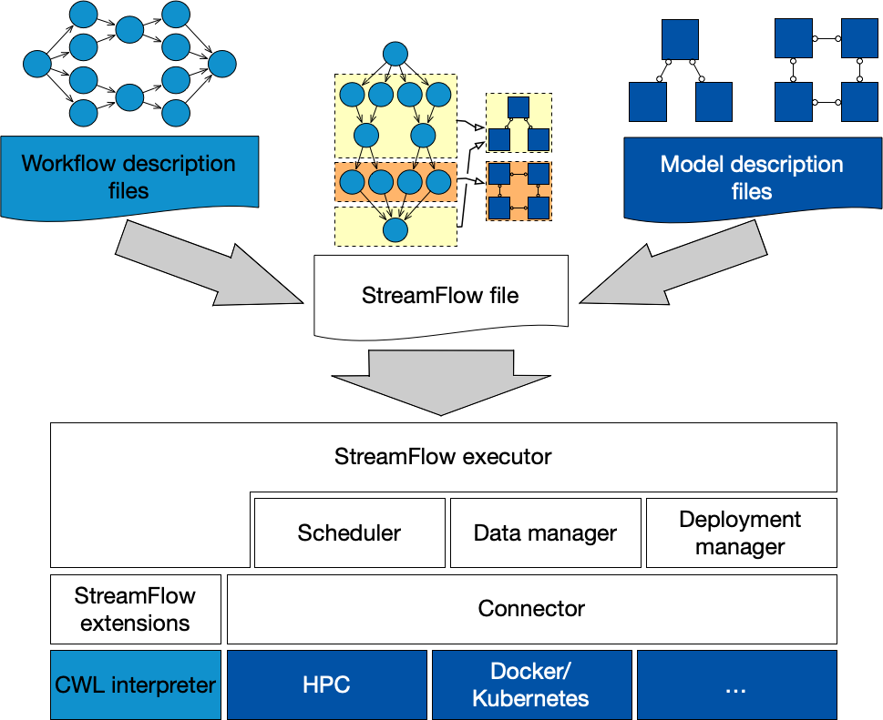

============
Architecture
============

The StreamFlow logical stack has been specifically developed to orchestrate hybrid workflows on top of heterogeneous and geographically distributed architectures.

StreamFlow input is composed of three main pieces:

* A workflow description, i.e. a representation of your application as a graph.
* One or more deployment descriptions, which are `infrastructure-as-code <https://en.wikipedia.org/wiki/Infrastructure_as_code>`_ representation of your execution environments.
* A StreamFlow file to bind each step of your workflow with the most suitable execution environment.

The rest of the stack is devoted to the remote step execution management, providing automatic deployment and undeployment, data-transfers, data-locality based scheduling, fault-tolerance, etc.

The environment stack
=====================

Another distinctive feature of the StreamFlow WMS is the possibility to manage complex, multi-agent execution environments ensuring the *co-allocation* of multiple heterogeneous processing elements to execute a single workflow step. The main advantage is introducing a unique interface to a diverse ecosystem of distributed applications, from MPI clusters running on HPC to microservices deployed on Kubernetes.

To provide enough flexibility, StreamFlow adopts a three-layered hierarchical representation of execution environments:

* A **deployment** is an entire multi-agent infrastructure and constitutes the *unit of deployment*, i.e., all its components are always co-allocated while executing a step.
* A **service** is a single agent type in a deployment and constitutes the *unit of binding*, i.e., each step of a workflow can be offloaded to a single service for execution.
* A **location** is a single instance of a potentially replicated service and constitutes the *unit of scheduling*, i.e., each step of a workflow is offloaded to a configurable number of service locations to be processed.

Workflow operations
===================

You need three different components to run a hybrid workflow with StreamFlow:

* A :ref:`workflow description <Write your workflow>`, i.e. a representation of your application as a graph.
* One or more :ref:`deployment descriptions <Import your environment>`, i.e. infrastructure-as-code representations of your execution environments.
* A :ref:`StreamFlow file <Put it all together>` to bind each step of your workflow with the most suitable execution environment.

StreamFlow will automatically take care of all the secondary aspects, like checkpointing, fault-tolerance, data movements, etc.